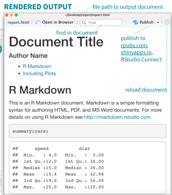

## Markdown

-   Lightweight markup language for creating formatted text using a plain-text editor
-   Created by **John Gruber** and **Aaron Swartz** in **2004**
-   **Aim:** Ease plain text conversion into rich text format, without any heavy codes  


## R Markdown

-   Package developped by **Yihui Xie** to integrated Markdown langage into R (around **2012** - 2014)
-   **Aim:** Facilitate reproducible research, allowing codes sharing with textual documentation on different form *(LaTeX, HTML, Markdown, etc.)* and for dynamic report generation with R. 
-   Yihui Xie: Author of **Knitr**, **blogdown**, **bookdown** etc.


## R markdown - Fonctionalities

-   R Markdown family of packages enables creating beautiful data science products like:

    -   books, blogs, websites, and presentations etc.

-   Aim: help you publish polished websites for sharing your work. E.g.:

    -   Present analyses or visualizations with R code ([Ex. My tutorial](https://rpubs.com/antoine-kossi/sir-analysis-with-r)),
    -   Slides (like this one you are seing),
    -   R package ([My package](https://package-metaan-rep.github.io/Metaan/)),
    -   Personal-professional websites, etc.

## Overview: Start using Rmarkdown

[](%22C:\Users\antoi\OneDrive%20-%20Karolinska%20Institutet\Analyses_08_MIPI_with_Machine_Learning_01_Mipi_Using_Artificial_Intelligence\Scripts_Epihubben_Journal_Club_Rmarkdown_files\Images\1image.png%22) [](%22C:\Users\antoi\OneDrive%20-%20Karolinska%20Institutet\Analyses_08_MIPI_with_Machine_Learning_01_Mipi_Using_Artificial_Intelligence\Scripts_Epihubben_Journal_Club_Rmarkdown_files\Images\2image.png%22)

## The magic behind

[](%22C:\Users\antoi\OneDrive%20-%20Karolinska%20Institutet\Analyses_08_MIPI_with_Machine_Learning_01_Mipi_Using_Artificial_Intelligence\Scripts_Epihubben_Journal_Club_Rmarkdown_files\Images\5image.png%22)

When you run render, R Markdown feeds the .Rmd file to knitr, which executes all of the code chunks and creates a new markdown (.md) document which includes the code and its output.

The markdown file generated by knitr is then processed by pandoc which is responsible for creating the finished format.

## Codes chunks

[](%22C:\Users\antoi\OneDrive%20-%20Karolinska%20Institutet\Analyses_08_MIPI_with_Machine_Learning_01_Mipi_Using_Artificial_Intelligence\Scripts_Epihubben_Journal_Club_Rmarkdown_files\Images\3image.png%22)

## Inline coding

-   You can insert chunks:
    -   keyboard shortcut **Ctrl + Alt + I** (OS X: **Cmd + Option + I**)
    -   Command in the editor toolbar
    -   Typing the chunk delimiters `{r} and`.
-   R Markdown run each code chunk and embed the results beneath the code chunk in your final report.

*NB: Chunk options for personnalised code output*


```r
# This is an example 
a <- c(1,2,3,4)
cat("The output of a =", a)
```

```
## The output of a = 1 2 3 4
```

## Tables - Figures


```r
plot(pressure)
```

<!-- -->

<!-- ## Tables - Figures -->

<!-- [](%22"C:\Users\antoi\OneDrive - Karolinska Institutet\Analyses\_08_MIPI_with_Machine_Learning\_01_Mipi_Using_Artificial_Intelligence\Scripts\_Epihubben_Journal_Club_Rmarkdown_files\Images\4image.jpg"%22) -->

## Tables - Figures


<table class=" lightable-classic" style="color: black; font-family: Cambria; width: auto !important; margin-left: auto; margin-right: auto;">
<caption>Example of embended table</caption>
 <thead>
  <tr>
   <th style="text-align:left;"> age_group </th>
   <th style="text-align:right;"> Number_events </th>
   <th style="text-align:right;"> Pers_years </th>
  </tr>
 </thead>
<tbody>
  <tr>
   <td style="text-align:left;"> 35-39 </td>
   <td style="text-align:right;"> 0 </td>
   <td style="text-align:right;"> 480 </td>
  </tr>
  <tr>
   <td style="text-align:left;"> 40-44 </td>
   <td style="text-align:right;"> 1 </td>
   <td style="text-align:right;"> 587 </td>
  </tr>
  <tr>
   <td style="text-align:left;"> 45-49 </td>
   <td style="text-align:right;"> 3 </td>
   <td style="text-align:right;"> 680 </td>
  </tr>
  <tr>
   <td style="text-align:left;"> 50-54 </td>
   <td style="text-align:right;"> 5 </td>
   <td style="text-align:right;"> 541 </td>
  </tr>
  <tr>
   <td style="text-align:left;"> 55-59 </td>
   <td style="text-align:right;"> 8 </td>
   <td style="text-align:right;"> 479 </td>
  </tr>
  <tr>
   <td style="text-align:left;"> 60-64 </td>
   <td style="text-align:right;"> 8 </td>
   <td style="text-align:right;"> 356 </td>
  </tr>
  <tr>
   <td style="text-align:left;"> 65-69 </td>
   <td style="text-align:right;"> 4 </td>
   <td style="text-align:right;"> 157 </td>
  </tr>
  <tr>
   <td style="text-align:left;"> 70-74 </td>
   <td style="text-align:right;"> 1 </td>
   <td style="text-align:right;"> 36 </td>
  </tr>
</tbody>
</table>

## Interactive Documents

R Markdown documents are a perfect platform for interactive content. To make your documents interactive, add:

-   Interactive JavaScript visualizations based on htmlwidgets, or
-   Reactive components made with Shiny (<u>**upcoming coding clubs**</u>)

[Interactive table](https://rpubs.com/antoine-kossi/sir-analysis-with-r)

[Scientific articles](%22C:\Users\antoi\OneDrive%20-%20Karolinska%20Institutet\Analyses_08_MIPI_with_Machine_Learning_01_Mipi_Using_Artificial_Intelligence\Manuscript_08_Introduction.pdf%22)

## Additional resources

[The reference guide](https://www.rstudio.com/wp-content/uploads/2015/03/rmarkdown-reference.pdf)

[The Rmarkdown cheatsheet](https://rmarkdown.rstudio.com/lesson-15.html)


### **Let's put this into practice**

-   If you don't have R and Rstudio installed, you can create a free account on [<u>R Studio Cloud</u>](https://posit.cloud/) and start using R.
